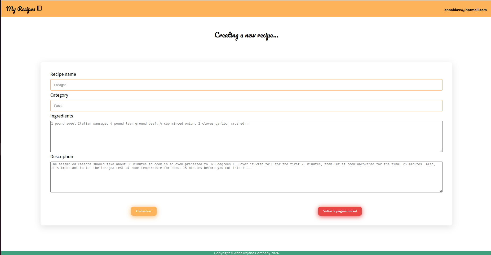
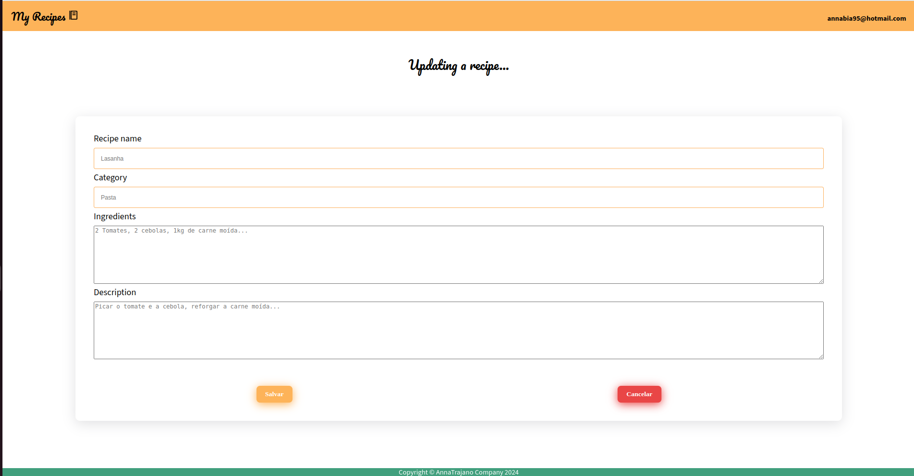
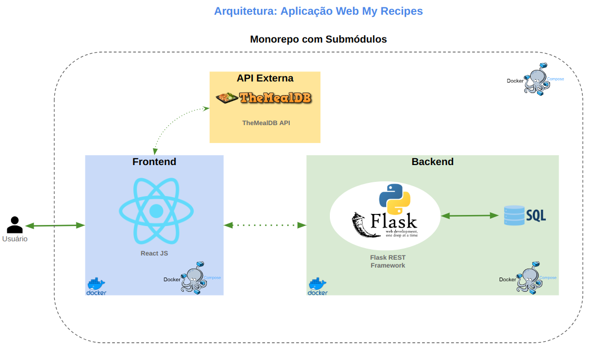

Este projeto contém os requisitos realizados por _[Anna Beatriz Garcia Trajano de Sá](www.linkedin.com/in/anna-beatriz-trajano-de-sá)_ enquanto cursava o curso de Pós-Graduação da PUC-RIO em Engenharia de Software. Ele engloba as disciplinas estudadas na primeira sprint (Desenvolvimento Full Stack Básico) e na quarta sprint (Arquitetura de Software) corresponde à parte Front-end da aplicação.

# My Recipes App

Neste projeto desenvolvi um app de receitas, utilizando o que há de mais moderno dentro do ecossistema React: Hooks e Context API!

Nele será possível ver, criar, filtar (por categoria) e deletar receitas!

A base de dados foram duas APIs distintas, uma para receitas já existentes e outra de criação própria para poder cadastrá-las em um banco de dados.

Veja o exemplo a seguir do layout do projeto!

## Layout

Login Page             
:-------------------------:|
  |

Home Page           |  Recipe Category Page
:-------------------------:|:-------------------------:
  |  

Recipe Category Page          | 
:-------------------------:|
  |

Create Recipe          |  Update Recipe
:-------------------------:|:-------------------------:
  |  

Recipes          |  
:-------------------------:|
  |

 
## Instalação do projeto localmente:
 
Após cada um dos passos, haverá um exemplo do comando a ser digitado para fazer o que está sendo pedido, caso tenha dificuldades e o exemplo não seja suficiente, não hesite em me contatar em _annatrajano95@gmail.com_ 

1. Abra o terminal e crie um diretório no local de sua preferência com o comando **mkdir**:
```javascript
  mkdir projetos
```

2. Entre no diretório que acabou de criar e depois clone o projeto:
```javascript
  cd projetos
  git clone git@github.com:annatrajano/my_recipes_front.git
```

3. Acesse o diretório do projeto e depois utilize o comando **npm i** para instalar todas as dependências necessárias:
```javascript
  cd my_recipes_front
  npm i
```

4. Por último, rode o comando **npm start** e acesse o projeto via browser, no caminho `http://localhost:3000/`.

```javascript
  npm start
```

## Como executar através do Docker
 
Certifique-se de ter o Docker instalado e em execução em sua máquina.

Navegue até o diretório que contém o arquivo **docker-compose.yml**. Execute, **como administrador**, o seguinte comando para construir a imagem Docker e subir o container:

```javascript
  docker compose up -d
```

## API Externa

É importante ressaltar que para o desenvolvimento deste projeto uma API externa foi utilizada, a [TheMeal DB ](https://www.themealdb.com/api.php), com o intuito de apresentar algumas receitas
de acordo com a categoria. Essa é uma API que não necessita de nenhuma licença de uso ou cadastro. A seguinte rota foi utilizada:

```javascript
 [GET] : www.themealdb.com/api/json/v1/1/filter.php?c=Category
```
Sendo que Category pode ser substituido por Seafood, Pasta....


## API de Dados

Para realizar o cadastro de uma nova receita, sua atualização, exibição e deleção, uma nova API foi desenvolvida. Caso deseje obter mais informações sobre, basta acessar o seguinte repositório: [My Recipes - API ](https://github.com/annatrajano/my_recipes_api). Todas as rotas implementadas nessa API foram chamadas na aplicação. Sendo elas:

```javascript
 [GET]: http://localhost:5000/recipes
```

```javascript
 [GET]: http://localhost:5000/recipe/{id}
```

```javascript
 [POST]: http://localhost:5000/recipe
```

```javascript
 [PUT]: http://localhost:5000/recipe/{id}
```

```javascript
 [DELETE]: http://localhost:5000/recipe/{id}
```
## Arquitetura do Projeto 

Com o intuito de facilitar o entendimento do funcionamento da aplicação como um todo, segue abaixo um fluxograma que exemplefica a arquitetura do projeto e os seus componentes:

 

Na imagem acima podemos visualizar os componentes que fazem parte da aplicação. O Frontend, Backend, a API externa (TheMealDB) e ainda um monorepositório composto pelos submódulos do front e do back.
Para acessar esse repositório clique aqui: [My Recipes - All ](https://github.com/annatrajano/my_recipes_all).


## Habilidades Desenvolvidas

Neste projeto, desenvolvi as seguintes habilidades:

 - Componentes reativos e modulares;
 - Arquivos estáticos;
 - React Router;
 - Gerenciamento de estados globais: Context API;
 - CSS Module;
 
 ## Referências
 [React](https://legacy.reactjs.org/docs/getting-started.html)<br>
 [TheMeal DB ](https://www.themealdb.com/api.php)<br>
 [Documentação oficial do React sobre Context API](https://reactjs.org/docs/context.html)<br>
 [CSS Module](https://blog.logrocket.com/a-deep-dive-into-css-modules/)<br>
 [React Icons](https://react-icons.github.io/react-icons/)<br>
 [Conventional Commits](https://gist.github.com/qoomon/5dfcdf8eec66a051ecd85625518cfd13)<br>


## Escopo do Projeto

 - Componentes
 - Tela de Login
 - Tela principal de receitas
 - Tela para cadastrar uma nova receita
 - Tela de receitas cadastradas
